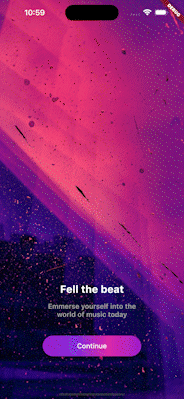

# Music App

Simple App to put in action the design create by Tetiana.

## Referência

 - [Tetiana Gulei's Music Mobile App UI](https://www.figma.com/community/file/1180142936953078905)

## Demo

## Tech and patterns used

- Flutter

## License

[MIT](https://choosealicense.com/licenses/mit/)

## Improvements

- Refactor the code
- Use provider as the state manager
- Add unit and integrations tests
- Consume Spotify's API

